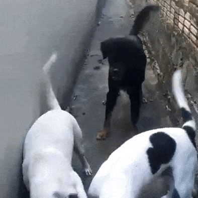

# dogs-plymouth-theme
A personal theme for plymouth, edit and use in your bootloader

## Animation File
You need to add your own `theme.gif` file. An animation of your choice.

## Convert the gif
Use the `gif-to-png.sh` script to generate the image frames. It will extract in the `img` folder.

## Apply
Use the `apply-theme.sh` script to update the kernel with the modifications.

## Be happy

